# Micro Services Architecture with Spring Cloud

In this tp we will develop several micro services for an application, as well as an API gateway and a directory of services.  Firstly, two microservices need to be created to manage customers and products, each with their own entity and Spring Data-based Repository interface, deployed with Spring Data Rest's Restful API and tested. Next, a service gateway needs to be created using Spring Cloud Gateway and tested using a static configuration based on the application.yml file . The next step is to create a service registry using Netflix Eureka Server . Another microservice must be created to handle billing, using Open Feign to communicate with the customer and product management microservices. Finally, an Angular client must be developed to display an invoice. 

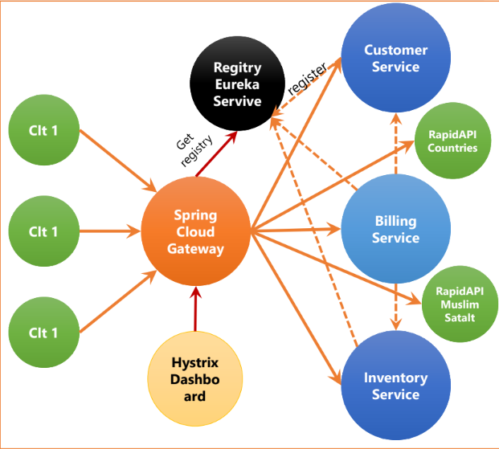

## Customer Service
### Customer Dependencies
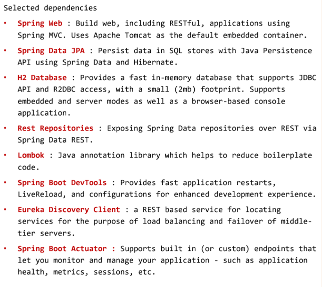

### Customer Class
```
import jakarta.persistence.Entity;
import jakarta.persistence.GeneratedValue;
import jakarta.persistence.GenerationType;
import jakarta.persistence.Id;
import lombok.AllArgsConstructor;
import lombok.Data;
import lombok.NoArgsConstructor;
import lombok.ToString;
@Entity
@Data
@NoArgsConstructor
@AllArgsConstructor
@ToString
class Customer{

    @Id
    @GeneratedValue(strategy = GenerationType.IDENTITY)
    private Long id; private String name; private String email;

}
```
### CustomerRepository Interface 
```
import org.springframework.data.jpa.repository.JpaRepository;
import org.springframework.data.rest.core.annotation.RepositoryRestResource;

@RepositoryRestResource
interface CustomerRepository extends JpaRepository<Customer,Long> { }

```

### CustomerProjection Interface 
```
import org.springframework.data.rest.core.config.Projection;

@Projection(name = "fullCustomer",types =
        Customer.class)
interface CustomerProjection extends Projection{

    public Long getId();
    public String getName();
    public String getEmail();

}
```
### Application.properties
```
spring.cloud.discovery.enabled=true
server.port=8081
spring.application.name=customer-service
management.endpoints.web.exposure.include=*
spring.datasource.url=jdbc:h2:mem:customer-db
eureka.client.service-url.defaultZone=http://localhost:8761/eureka
```
### CustomerServiceApplication 
```
import org.springframework.boot.CommandLineRunner;
import org.springframework.boot.SpringApplication;
import org.springframework.boot.autoconfigure.SpringBootApplication;
import org.springframework.context.annotation.Bean;
import org.springframework.data.rest.core.config.RepositoryRestConfiguration;
@SpringBootApplication
public class CustomerServiceApplication {
	public static void main(String[] args) { SpringApplication.run(CustomerServiceApplication.class, args); }

	@Bean
	CommandLineRunner start(CustomerRepository customerRepository, RepositoryRestConfiguration repositoryRestConfiguration){
        repositoryRestConfiguration.exposeIdsFor(Customer.class);
		return args -> {

			customerRepository.save(new Customer(null,"Enset","contact@enset-media.ma"));
			customerRepository.save(new Customer(null,"FSTM","contact@fstm.ma"));
			customerRepository.save(new Customer(null,"ENSAM","contact@ensam.ma"));
			customerRepository.findAll().forEach(System.out::println);

		};
	}
}

```

<pre style="background-color: white">
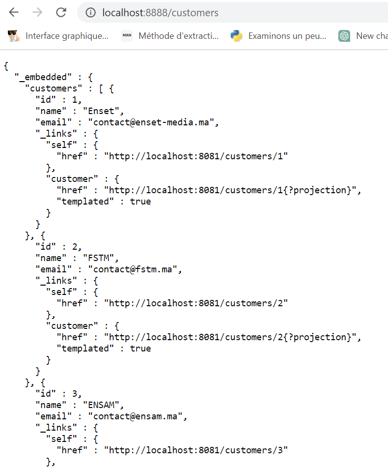  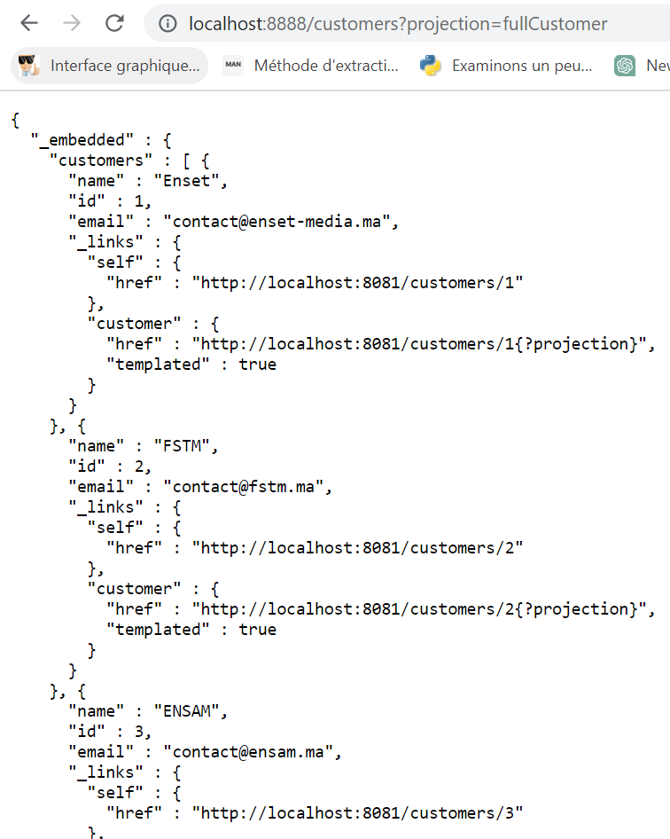

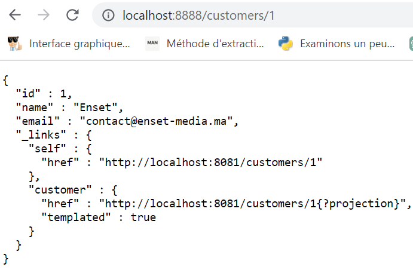 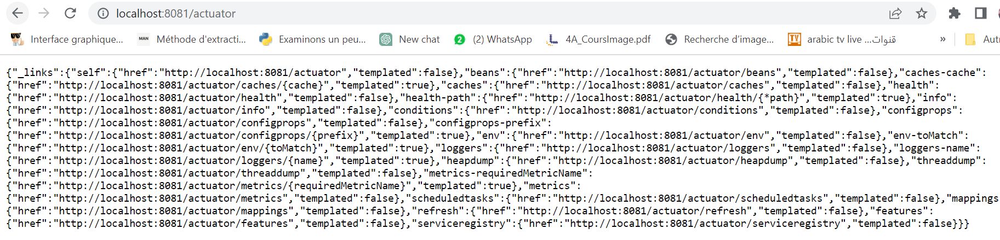

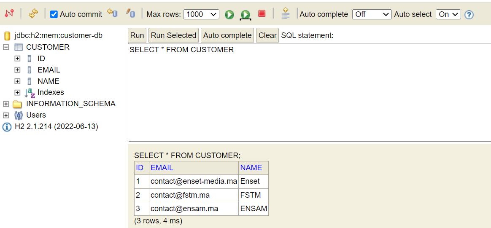
</pre>

## Inventory Service
### Inventory Dependencies 
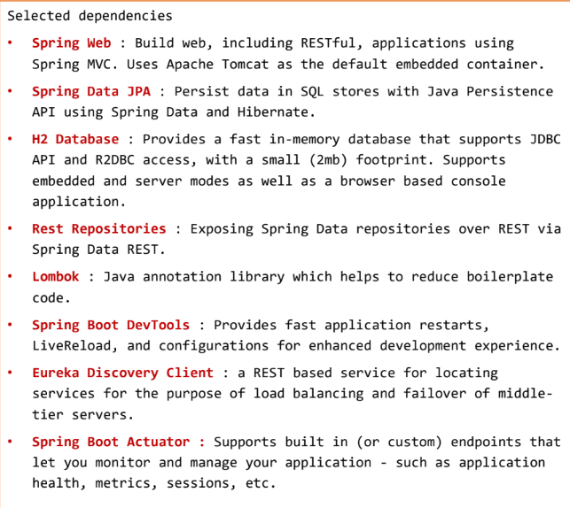

### Product class
```
package org.sdia.Inventoryservice;
import jakarta.persistence.Entity;
import jakarta.persistence.GeneratedValue;
import jakarta.persistence.GenerationType;
import jakarta.persistence.Id;
import lombok.AllArgsConstructor;
import lombok.Data;
import lombok.NoArgsConstructor;
import lombok.ToString;
@Entity
@Data
@NoArgsConstructor
@AllArgsConstructor
@ToString
class Product{

    @Id
    @GeneratedValue(strategy = GenerationType.IDENTITY)
    private Long id; private String name;private double price;

}
```
### ProductRepository Interface
```
import org.springframework.data.jpa.repository.JpaRepository;
import org.springframework.data.rest.core.annotation.RepositoryRestResource;

@RepositoryRestResource
interface ProductRepository extends JpaRepository<Product,Long> { }
```
### Application.properties
```
spring.cloud.discovery.enabled=true
server.port=8082
spring.application.name=inventory-service
spring.datasource.url=jdbc:h2:mem:product-db
eureka.client.service-url.defaultZone=http://localhost:8761/eureka
```
### InventoryServiceApplication
```
import org.springframework.boot.CommandLineRunner;
import org.springframework.boot.SpringApplication;
import org.springframework.boot.autoconfigure.SpringBootApplication;
import org.springframework.context.annotation.Bean;
import org.springframework.data.rest.core.config.RepositoryRestConfiguration;
@SpringBootApplication
public class InventoryServiceApplication {

	public static void main(String[] args) { SpringApplication.run(InventoryServiceApplication.class, args);}
	@Bean
	CommandLineRunner start(ProductRepository productRepository, RepositoryRestConfiguration repositoryRestConfiguration){
        repository
        RestConfiguration.exposeIdsFor(Product.class);
		return args -> {

			productRepository.save(new Product(null,"Computer Desk Top HP",900));
			productRepository.save(new Product(null,"Printer Epson",80));
			productRepository.save(new Product(null,"MacBook Pro Lap Top",1800));
			productRepository.findAll().forEach(System.out::println);

		};
	}
}
```

<pre style="background-color: white">
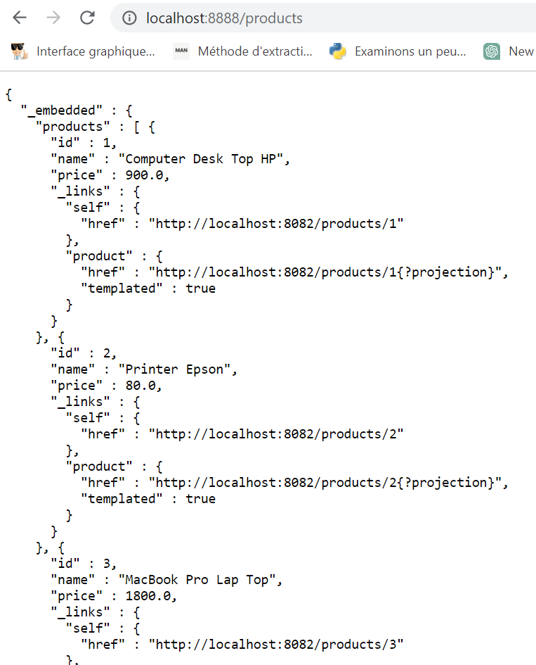     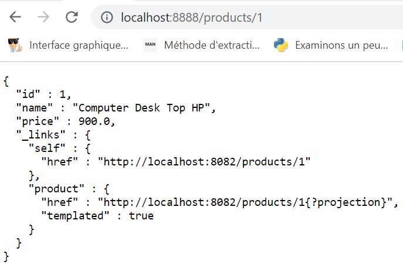 

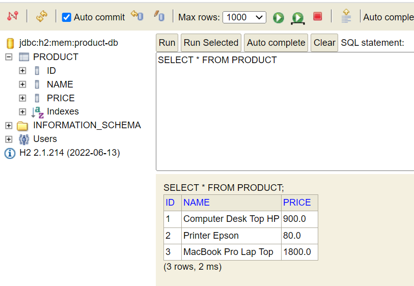
</pre>

## Billing-service
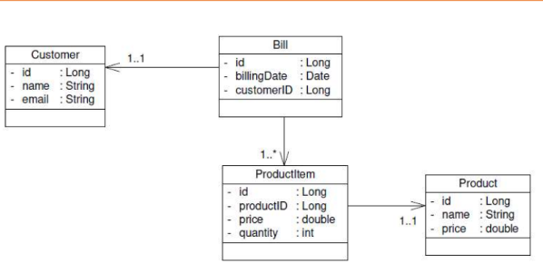

### Billing Dependencies

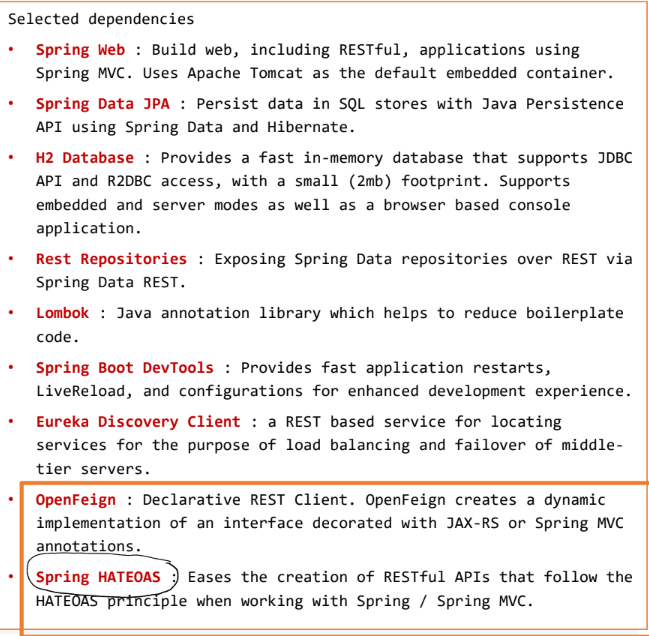


### Bill class

```
import jakarta.persistence.*;
import lombok.AllArgsConstructor;
import lombok.Data;
import lombok.NoArgsConstructor;
import java.util.Collection;
import java.util.Date;
@Entity @Data @NoArgsConstructor @AllArgsConstructor
public class Bill{
    @Id
    @GeneratedValue(strategy = GenerationType.IDENTITY)
    private Long id; private Date billingDate;
    @OneToMany(mappedBy = "bill")
    private Collection<ProductItem> productItems;
    private Long customerID;
    @Transient private Customer customer;
}

```
### BillRepository Interface
```
import org.springframework.data.jpa.repository.JpaRepository;
import org.springframework.data.rest.core.annotation.RepositoryRestResource;

@RepositoryRestResource
interface BillRepository extends JpaRepository<Bill,Long> {}
```

### Customer Class
```
import lombok.Data;

@Data
class Customer{

    private Long id;
    private String name;
    private String email;

}
```
### Product class
```
import lombok.Data;
@Data
class Product{

    private Long id;
    private String name;
    private double price;

}
```
### CustomerServiceClient Interface 
```
import org.springframework.cloud.openfeign.FeignClient;
import org.springframework.web.bind.annotation.GetMapping;
import org.springframework.web.bind.annotation.PathVariable;

@FeignClient(name="customer-service")
interface CustomerServiceClient{
    @GetMapping("/customers/{id}?projection=fullCustomer")
    Customer findCustomerById(@PathVariable("id") Long id);
}

```
### InventoryServiceClient Interface 
```
import org.springframework.cloud.openfeign.FeignClient;
import org.springframework.hateoas.PagedModel;
import org.springframework.web.bind.annotation.GetMapping;
import org.springframework.web.bind.annotation.PathVariable;
import org.springframework.web.bind.annotation.RequestParam;

@FeignClient(name="inventory-service")
interface InventoryServiceClient{

    @GetMapping("/products/{id}")
    Product findProductById(@PathVariable("id") Long id);

    @GetMapping("/products?projection=fullProduct")
    PagedModel<Product> findAll();

    @GetMapping(path="/products")
    PagedModel <Product> pageProducts();
    
}

```
### ProductItem Class
```
import com.fasterxml.jackson.annotation.JsonProperty;
import jakarta.persistence.*;
import lombok.AllArgsConstructor;
import lombok.Data;
import lombok.NoArgsConstructor;
@Entity @Data
@NoArgsConstructor
@AllArgsConstructor
class ProductItem{
    @Id
    @GeneratedValue(strategy = GenerationType.IDENTITY)
    private Long id;
    private long productID;
    private double price; private double quantity;
    @JsonProperty(access= JsonProperty.Access.WRITE_ONLY)
    @ManyToOne
    private Bill bill;
    @Transient
    private Product product;
}
```
### ProductItemRepository Interface
```
import org.springframework.data.jpa.repository.JpaRepository;
import org.springframework.data.rest.core.annotation.RepositoryRestResource;
import java.util.List;
@RepositoryRestResource
interface ProductItemRepository extends
        JpaRepository<ProductItem,Long> {

    List<ProductItem> findByBillId(Long billID);

}
```
### BillRestController class
```
import org.springframework.beans.factory.annotation.Autowired;
import org.springframework.web.bind.annotation.GetMapping;
import org.springframework.web.bind.annotation.PathVariable;
import org.springframework.web.bind.annotation.RestController;
@RestController
class BillRestController{

    @Autowired
    private BillRepository billRepository;
    @Autowired private ProductItemRepository productItemRepository;
    @Autowired private CustomerServiceClient customerServiceClient;
    @Autowired private InventoryServiceClient inventoryServiceClient;
    @GetMapping("/bills/full/{id}")
    public Bill getBill(@PathVariable(name="id") Long id){
        Bill bill=billRepository.findById(id).get();
        Customer customer=customerServiceClient.findCustomerById(bill.getCustomerID());
        bill.setCustomer(customer);
        bill.getProductItems().forEach(pi->{
            System.out.println(pi.getProductID()+" "+pi.getPrice());
            Product product=inventoryServiceClient.findProductById(pi.getProductID());
            pi.setProduct(product);
        });
        return bill; }

}
```
### Application.properties
```
spring.cloud.discovery.enabled=true
server.port=8083
spring.application.name=billing-service
spring.datasource.url=jdbc:h2:mem:billing-db
eureka.client.service-url.defaultZone=http://localhost:8761/eureka

```

### BillingServiceApplication 
```
import org.springframework.boot.CommandLineRunner;
import org.springframework.boot.SpringApplication;
import org.springframework.boot.autoconfigure.SpringBootApplication;
import org.springframework.cloud.openfeign.EnableFeignClients;
import org.springframework.context.annotation.Bean;
import org.springframework.hateoas.PagedModel;
import java.util.Date;
import java.util.Random;
@SpringBootApplication
@EnableFeignClients
public class BillingServiceApplication {
	public static void main(String[] args) {SpringApplication.run(BillingServiceApplication.class, args); }
	@Bean
	CommandLineRunner start(BillRepository billRepository, ProductItemRepository productItemRepository,
							InventoryServiceClient inventoryServiceClient, CustomerServiceClient customerServiceClient){

		return args -> {

			Customer customer=customerServiceClient.findCustomerById(1L);
            Bill bill1=billRepository.save(new Bill(null,new Date(),null,customer.getId(),null));
			PagedModel<Product> productPageModel=inventoryServiceClient.pageProducts();

			productPageModel.forEach(p->{
				ProductItem productItem=new ProductItem();
				productItem.setPrice(p.getPrice());
				productItem.setQuantity(1+new Random().nextInt(100));
				productItem.setProductID(p.getId());
				System.out.println("----"+p.getId());
				productItem.setBill(bill1);
				//productItems.add(productItem);

				productItemRepository.save(productItem);
			});
		};
	}}
```
<pre style="background-color: white">
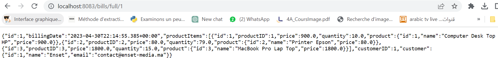

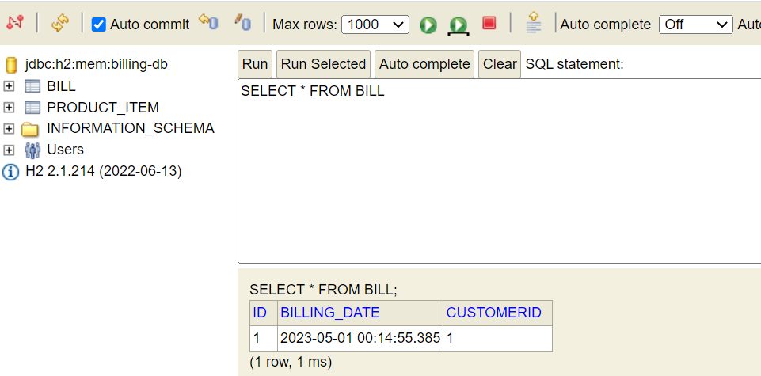  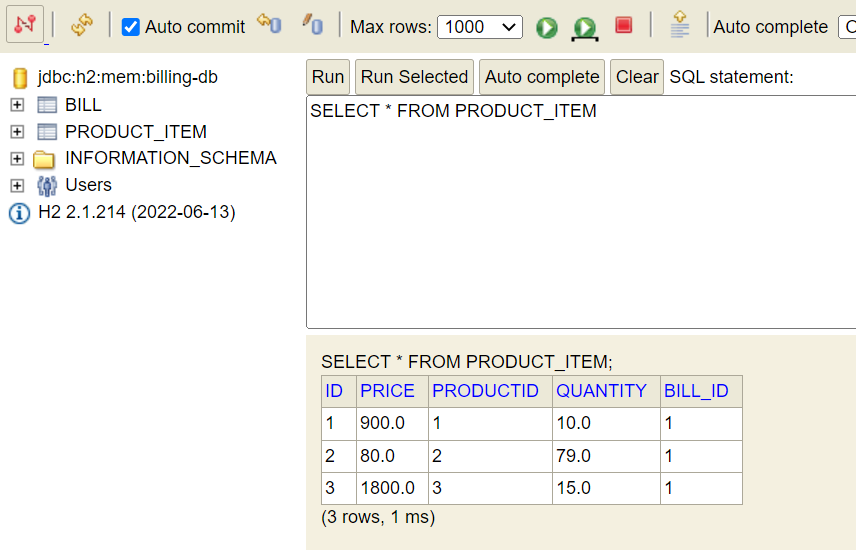
</pre>
## Gateway-service
### Gateway Dependencies
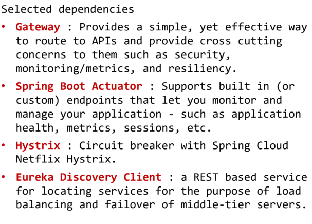

### Application.yml

```
spring:
  cloud:
     gateway:
       routes:
           - id : r1
             uri : lb://CUSTOMER-SERVICE
             predicates :
                - Path= /customers/**
           - id : r2
             uri : lb://INVENTORY-SERVICE
             predicates :
                - Path= /products/**
     discovery:
       enabled: true
server:
   port: 8888
```
### GatewayServiceApplication
```
import org.springframework.boot.SpringApplication;
import org.springframework.boot.autoconfigure.SpringBootApplication;

@SpringBootApplication
public class GatewayServiceApplication {

	public static void main(String[] args) {
		SpringApplication.run(GatewayServiceApplication.class, args);
	}

}

```
## Eureka Discovery Service
### Eureka Dependencies
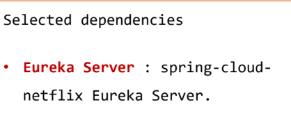

### Application.properties
```
server.port=8761
# dont register server itself as a client.
eureka.client.fetch-registry=false
# Does not register itself in the service registry.
eureka.client.register-with-eureka=false

```
### DiscoveryServiceApplication
```
import org.springframework.boot.SpringApplication;
import org.springframework.boot.autoconfigure.SpringBootApplication;
import org.springframework.cloud.netflix.eureka.server.EnableEurekaServer;
@SpringBootApplication
@EnableEurekaServer
public class DiscoveryServiceApplication {
	public static void main(String[] args) {
		SpringApplication.run(DiscoveryServiceApplication.class, args);
	}
}
```
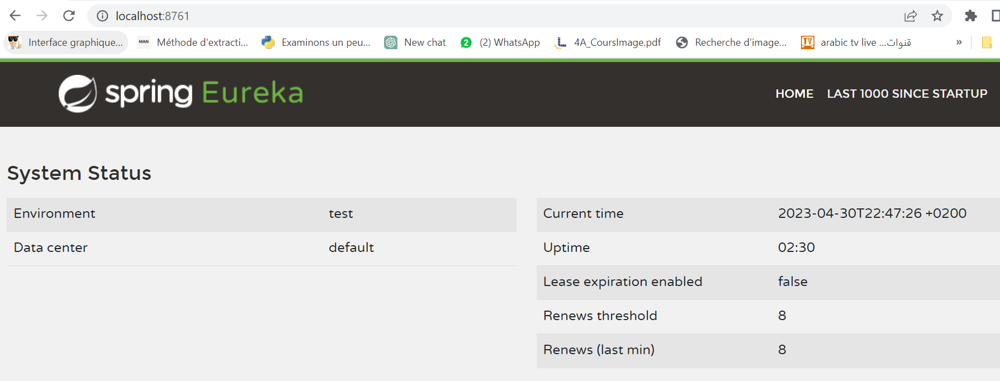

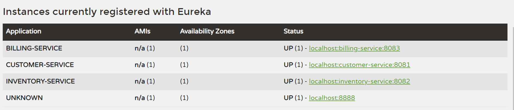

### Liens 
<ul>
<li>  <a href="https://github.com/SakuraMH/Customer-Service">Customer Service</a> </li>
<li><a href="https://github.com/SakuraMH/Inventory-service">Inventory Service</a> </li>
<li><a href="https://github.com/SakuraMH/Billing-service"> Billing Service</a> </li>
</ul>

 